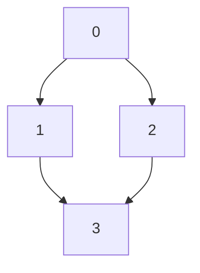

# 207. 课程表

**难度：<DifficultyBadge>中等</DifficultyBadge>**

## 题目描述

现在你总共有 `numCourses` 门课要选，记为从 `0` 到 `numCourses - 1`。

给你一个数组 `prerequisites`，其中 `prerequisites[i] = [ai, bi]` 表示如果要选修课程 `ai`，则必须先选修课程 `bi`。

例如，先修课程对 `[0, 1]` 表示：想要选修课程 `0`，你需要先选修课程 `1`。

返回你为了学完所有课程所安排的学习顺序。可能会有多个正确的顺序，你只要返回 **任意一个** 就可以了。如果不可能学完所有课程，返回 **一个空数组**。

### 示例

**示例 1：**
```
输入：numCourses = 2, prerequisites = [[1,0]]
输出：[0,1]
解释：总共有 2 门课程。要学习课程 1，你需要先完成课程 0。因此，正确的学习顺序是 [0,1]。
```

**示例 2：**
```
输入：numCourses = 4, prerequisites = [[1,0],[2,0],[3,1],[3,2]]
输出：[0,2,1,3]
解释：总共有 4 门课程。要学习课程 3，你需要先完成课程 1 和课程 2。课程 1 和课程 2 的学习顺序可以自由安排。
因此，一个正确的学习顺序是 [0,2,1,3]。
```

**示例 3：**
```
输入：numCourses = 1, prerequisites = []
输出：[0]
```

### 提示

- `1 <= numCourses <= 2000`
- `0 <= prerequisites.length <= numCourses * (numCourses - 1) / 2`
- `prerequisites[i]` 中的所有课程对都不同

---

## 拓扑排序简介

### 什么是拓扑排序？

**拓扑排序**（Topological Sorting）是对有向无环图（DAG）的顶点进行排序，使得对于每一条有向边 `(u, v)`，顶点 `u` 都在顶点 `v` 之前。

### 课程依赖关系图

将课程作为图的顶点，先修关系作为有向边：
- `[a, b]` 表示从 `b` → `a` 的边（必须先学 `b`，再学 `a`）

### 示例图解

以 `numCourses = 4, prerequisites = [[1,0],[2,0],[3,1],[3,2]]` 为例：



课程学习顺序：
1. 可以先学课程 0（没有先修要求）
2. 然后学课程 1 和 2（都已完成先修课程 0）
3. 最后学课程 3（已完成先修课程 1 和 2）

---

## 解法一：Kahn 算法（拓扑排序 + BFS）

### 思路

Kahn 算法是一种基于贪心的拓扑排序算法：

1. **构建图和入度表**
   - `graph[u]` - 记录从 `u` 指向的所有课程
   - `in_degree[v]` - 记录每个课程 `v` 的入度（有多少门课依赖于它）

2. **初始化队列**
   - 将所有入度为 0 的课程加入队列（这些课程没有先修要求，可以直接学习）

3. **BFS 遍历**
   - 从队列中取出一个课程，加入结果
   - 减少该课程所有邻接课程的入度
   - 如果邻接课程入度变为 0，加入队列

4. **检测环**
   - 如果最终结果包含所有课程，说明无环，可以完成学习
   - 否则，说明有环，无法完成所有课程

### Python

```python
from typing import List
from collections import deque, defaultdict

class Solution:
    def findOrder(self, numCourses: int, prerequisites: List[List[int]]) -> List[int]:
        """
        Kahn 算法 - 基于 BFS 的拓扑排序
        时间复杂度: O(V + E)，V = 课程数，E = 边数
        空间复杂度: O(V + E)
        """
        # 1. 初始化图和入度数组
        graph = defaultdict(list)  # graph[u] = [v1, v2, ...]
        in_degree = [0] * numCourses

        # 2. 构建图
        for course, prereq in prerequisites:
            graph[prereq].append(course)  # 从先修课程指向依赖课程
            in_degree[course] += 1  # 增加依赖课程的入度

        # 3. 初始化队列 - 所有入度为 0 的课程
        queue = deque([i for i in range(numCourses) if in_degree[i] == 0])
        result = []

        # 4. BFS 拓扑排序
        while queue:
            course = queue.popleft()
            result.append(course)

            # 遍历所有依赖当前课程的课程
            for next_course in graph[course]:
                in_degree[next_course] -= 1
                if in_degree[next_course] == 0:
                    queue.append(next_course)

        # 5. 检查是否学完所有课程
        return result if len(result) == numCourses else []
```

### C++

```cpp
#include <vector>
#include <queue>
using namespace std;

class Solution {
public:
    vector<int> findOrder(int numCourses, vector<vector<int>>& prerequisites) {
        /**
         * Kahn 算法 - 基于 BFS 的拓扑排序
         * 时间复杂度: O(V + E)，V = 课程数，E = 边数
         * 空间复杂度: O(V + E)
         */
        vector<vector<int>> graph(numCourses);
        vector<int> in_degree(numCourses, 0);

        // 1. 构建图和入度数组
        for (const auto& prereq : prerequisites) {
            int course = prereq[0];
            int pre = prereq[1];
            graph[pre].push_back(course);  // 从先修课程指向依赖课程
            in_degree[course]++;  // 增加依赖课程的入度
        }

        // 2. 初始化队列 - 所有入度为 0 的课程
        queue<int> q;
        for (int i = 0; i < numCourses; i++) {
            if (in_degree[i] == 0) {
                q.push(i);
            }
        }

        vector<int> result;
        vector<int> visited(numCourses, 0);

        // 3. BFS 拓扑排序
        while (!q.empty()) {
            int course = q.front();
            q.pop();
            result.push_back(course);
            visited[course] = 1;

            // 遍历所有依赖当前课程的课程
            for (int next_course : graph[course]) {
                if (!visited[next_course]) {
                    in_degree[next_course]--;
                    if (in_degree[next_course] == 0) {
                        q.push(next_course);
                    }
                }
            }
        }

        // 4. 检查是否学完所有课程
        if ((int)result.size() == numCourses) {
            return result;
        }
        return {};
    }
};
```

### 复杂度分析

| 指标 | 复杂度 | 说明 |
|------|-------|------|
| 时间复杂度 | O(V + E) | V = 课程数，E = 先修关系数，每个顶点/边访问一次 |
| 空间复杂度 | O(V + E) | 需要存储图和入度数组 |

---

## 解法二：DFS（深度优先搜索）

### 思路

使用 DFS 检测环并生成拓扑排序：

1. **构建图** - 与 Kahn 算法相同
2. **状态标记**
   - `0` - 未访问
   - `1` - 正在访问（递归栈中）
   - `2` - 已完成访问
3. **DFS 递归**
   - 对每个未访问的顶点进行 DFS
   - 如果遇到状态为 `1` 的顶点，说明存在环
   - 如果没有环，将顶点加入结果（后序追加）
4. **逆序结果** - DFS 的后序遍历反转后即为拓扑序

### Python

```python
from typing import List

class Solution:
    def findOrder(self, numCourses: int, prerequisites: List[List[int]]) -> List[int]:
        """
        DFS 算法 - 基于深度优先搜索的拓扑排序
        时间复杂度: O(V + E)
        空间复杂度: O(V)
        """
        # 1. 构建图
        graph = [[] for _ in range(numCourses)]
        for course, prereq in prerequisites:
            graph[prereq].append(course)

        # 2. 状态数组
        VISITED = 0
        VISITING = 1
        DONE = 2
        state = [VISITED] * numCourses
        result = []
        has_cycle = False

        # 3. DFS 递归函数
        def dfs(course: int):
            nonlocal has_cycle
            if state[course] == VISITING:
                # 遇到正在访问的节点，说明存在环
                has_cycle = True
                return
            if state[course] == DONE or has_cycle:
                # 已经完成或有环，直接返回
                return

            # 标记为正在访问
            state[course] = VISITING

            # 访问所有依赖课程
            for next_course in graph[course]:
                dfs(next_course)
                if has_cycle:
                    return

            # 标记为已完成
            state[course] = DONE
            # 添加到结果（后序位置）
            result.append(course)

        # 4. 对每个未访问的课程进行 DFS
        for i in range(numCourses):
            if state[i] == VISITED:
                dfs(i)
                if has_cycle:
                    return []

        # 5. 反转结果得到正确的拓扑序
        return result[::-1]
```

### C++

```cpp
#include <vector>
using namespace std;

class Solution {
private:
    enum State { VISITED, VISITING, DONE };

    bool has_cycle;

    bool dfs(int course, const vector<vector<int>>& graph, vector<int>& state, vector<int>& result) {
        if (state[course] == VISITING) {
            // 遇到正在访问的节点，说明存在环
            return true;
        }
        if (state[course] == DONE) {
            // 已经完成，直接返回
            return false;
        }

        // 标记为正在访问
        state[course] = VISITING;

        // 访问所有依赖课程
        for (int next_course : graph[course]) {
            if (dfs(next_course, graph, state, result)) {
                return true;  // 存在环
            }
        }

        // 标记为已完成
        state[course] = DONE;
        // 添加到结果（后序位置）
        result.push_back(course);
        return false;
    }

public:
    vector<int> findOrder(int numCourses, vector<vector<int>>& prerequisites) {
        /**
         * DFS 算法 - 基于深度优先搜索的拓扑排序
         * 时间复杂度: O(V + E)
         * 空间复杂度: O(V)
         */
        // 1. 构建图
        vector<vector<int>> graph(numCourses);
        for (const auto& prereq : prerequisites) {
            int course = prereq[0];
            int pre = prereq[1];
            graph[pre].push_back(course);
        }

        // 2. 状态数组
        vector<int> state(numCourses, VISITED);
        vector<int> result;

        // 3. 对每个未访问的课程进行 DFS
        for (int i = 0; i < numCourses; i++) {
            if (state[i] == VISITED) {
                if (dfs(i, graph, state, result)) {
                    return {};  // 存在环，无法完成所有课程
                }
            }
        }

        // 4. 反转结果得到正确的拓扑序
        reverse(result.begin(), result.end());
        return result;
    }
};
```

### 复杂度分析

| 指标 | 复杂度 | 说明 |
|------|-------|------|
| 时间复杂度 | O(V + E) | V = 课程数，E = 先修关系数 |
| 空间复杂度 | O(V) | 递归栈和状态数组 |

---

## 两种解法对比

| 特征 | Kahn 算法 (BFS) | DFS |
|------|----------------|-----|
| 实现难度 | 中等 | 较难 |
| 检测环 | 自动检测 | 通过状态标记 |
| 生成顺序 | 正序 | 逆序 |
| 理解难度 | 较简单 | 需要理解递归和回溯 |
| 应用场景 | 需要正序拓扑 | 需要逆序拓扑 |
| 状态管理 | 入度数组 | 三态标记 |

## 总结

- **拓扑排序**是解决有依赖关系排序问题的经典算法
- **Kahn 算法**更直观，易于理解和实现
- **DFS 算法**更高效，代码更简洁
- **关键点：** 检测环是拓扑排序的核心问题
